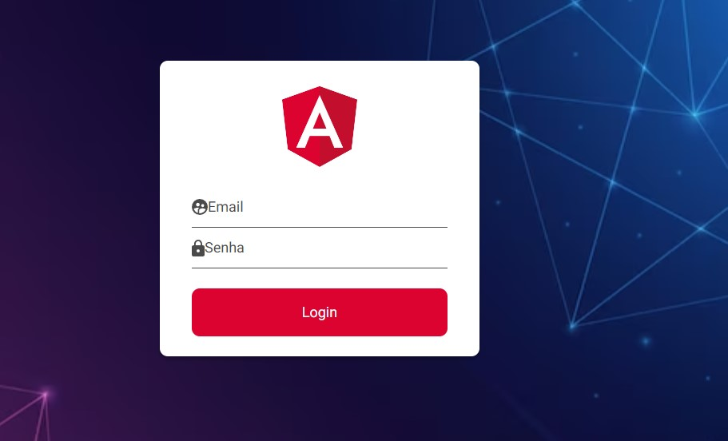
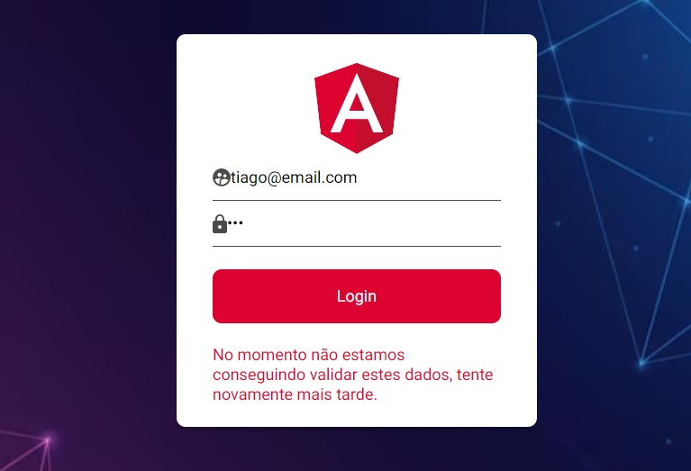

# Auth-Front-Login

This project was generated with [Angular CLI](https://github.com/angular/angular-cli) version 16.1.4.
 

Front Page de Login

## Tenologias Utilizadas
 
 
 
  
  
 
  
  
 

 

 
 

 ##Sobre o App
 

 ⚡ - Nesta front page o objetivo foi criar uma interface para login onde o  usuário poderá fazer este login utilizando o email tiago@email.com e a senha 123, onde a página retornará sucesso, como segue a imagem.
 

 

 
 

 

 ⚡ - Caso os dados não forem checados irá aparecer uma tela de erro indicando que o servidor pode ter caido ou estar desativado, como mostra a imagem abaixo. Utilizamos também um servidor fake de JWT para que a aplicação rodasse de forma correta.
 

 

 
 

## Development server

Run `ng serve` for a dev server. Navigate to `http://localhost:4200/`. The application will automatically reload if you change any of the source files.

## Code scaffolding

Run `ng generate component component-name` to generate a new component. You can also use `ng generate directive|pipe|service|class|guard|interface|enum|module`.

## Build

Run `ng build` to build the project. The build artifacts will be stored in the `dist/` directory.

## Running unit tests

Run `ng test` to execute the unit tests via [Karma](https://karma-runner.github.io).

## Running end-to-end tests

Run `ng e2e` to execute the end-to-end tests via a platform of your choice. To use this command, you need to first add a package that implements end-to-end testing capabilities.

## Further help

To get more help on the Angular CLI use `ng help` or go check out the [Angular CLI Overview and Command Reference](https://angular.io/cli) page.
